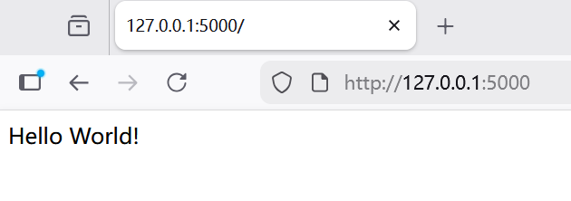
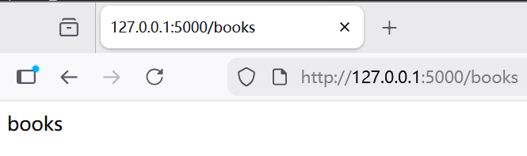

# Flask是什么

Flask是一个使用Python编写的轻量级Web应用框架。基于Werkzeug WSGI工具箱和Jinja2模板引擎，使用BSD授权。这种 “微框架”使用简单的核心，用扩展增加其他功能，但没有默认使用的数据库和表单验证工具。

——[维基百科](https://zh.wikipedia.org/zh-cn/Flask)

---


### Flask梦的开始


我们在python中输入了一个最简单的Flask应用服务，可以将它简单理解为一个基础模板，为我们提供了最简单的执行框架，将它保存为.py后缀，如app.py。

```python
from flask import Flask  #导入Flask类
#创建Flask应用实例
app = Flask(__name__)   #Flask在这里被调用（实例化）


@app.route('/')   #使用app实例定义路由
def hello_world():
    return 'Hello World!'


if __name__ == '__main__':
    app.run()  #运行
```


运行以后，我们将得到这样的输出


`` * Running on http://127.0.0.1:5000``


访问这串地址，我们会进入一个简单到只有一行"Hello World!"的网页。


---

## 拆解


在探究结果之前，我们先简单拆解一下这几行代码。

```python
from flask import Flask   #从flask包中导入Flask类
app = Flask(__name__)   # 创建一个对象
```


**flask**是一个 Python 包（文件夹），包含了 Flask 框架的所有代码；

**Flask**是 flask 包中定义的一个类，Flask类是一个核心类，用于创建Flask应用实例。


前者是包名，后者是类名。

- 在C语言里，我们通过包含头文件来引入函数和变量的声明，以便在程序中使用。而在Python中，我们通过导入模块或包来引入其中定义的类、函数或变量。作为初学者我们可以在此把它简单类比为c语言中的头文件以方便理解。
- 

**__name__**是一个特殊的python变量，表示当前模块的名字。


### 路由

```python
@app.route('/')
def hello_world():
    return 'Hello World!'
```

这是一个简单的路由。


**route**是一个装饰器，装饰器以 @ 开头，它的作用就是将处理请求的函数绑定到URL上（URL必须以反斜杠开头），这种设计体现了解耦的思想。不同的请求被路由到不同处理函数上，这个函数称之为视图。 ——COOLPython

- 在本示例中route用来装饰后面的函数``hello_world``。

- 当请求的path 是` /` 时，用`hello_world`来处理这个请求，返回字符串Hello World!


运行结果>>http://127.0.0.1:5000/



作为对照，我们添加一个新的路由：

```python
@app.route('/books')
def books():
    return 'books'
```


当请求的path 是`/books`时，用`books`来处理这个请求，返回字符串books


运行结果>>http://127.0.0.1:5000/books




### 变量规则

以上无论是 `/hello` 还是 `/books/` 这种URL都是固定的，如果我们想要通过URL传递参数呢？


变量部分的规则为 <converter:variable_name>，variable_name将作为参数传递给所绑定的函数，而且可以根据converter转换器对variable_name进行转换。

下面是这几种转换器的例子：

```python
# 不指定转换器
@app.route('/book/<name>/author')   
def author(name):
    return name   #不标注转换器类型，则默认转为字符串

# 转换器为int
@app.route('/book/<int:id>/price') 
def price(id):
    return str(id)   

# 转换器为float
@app.route('/book/price-ge/<float:price>')   
def books_by_price(price):
    return str(price)

# 转换器为path
@app.route('/book/<path:book_info>')   
def books_by_path(book_info):
    return book_info
```

http://127.0.0.1:5000/book/%E7%A5%9E%E7%A7%98%E8%84%91%E6%9C%BA/author  >>>神秘脑机

http://127.0.0.1:5000/book/6/price     >>>6

http://127.0.0.1:5000/book/price-ge/3.1415   >>>3.1415

http://127.0.0.1:5000/book/3/4/5/6/7   >>>3/4/5/6/7


## app.run


```python
if __name__ == '__main__':
    app.run() 
```


这其实是一个TCP服务端程序，也就是一个socket服务，我们可以把它修改成：

```python
if __name__ == '__main__':
    app.run(host='0.0.0.0', port=1122)
```


以此改变监听的端口号

- 如果你运行服务器，会发现服务器只能从你自己的计算机访问，而无法从网络中的任何其他计算机访问。这是默认设置，因为在调试模式下，应用程序的用户可以在你的计算机上执行任意 Python 代码。

- 如果你希望这个socket只能本本机的客户端访问，那么host设置成`127.0.0.1`
- 如果希望所有机器都能访问，host需要设置成`0.0.0.0`


---

### 感想

噔↗噔↗噔↘噔↗！目标失衡！
