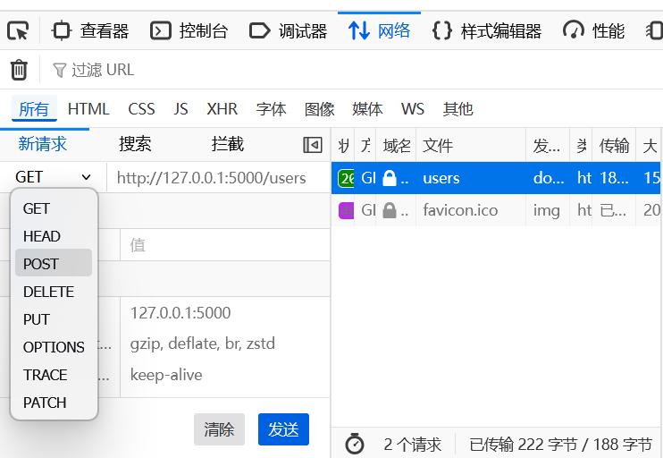
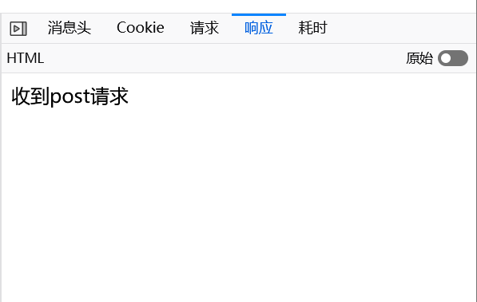

## 路由规则管理

---


添加路由规则有两种方式：

- 使用route添加路由规则

```python
@app.route('/add_url')
def add_rule():
    return 'add url rule'
```


- 使用add_url_rule添加路由规则

```python
def add_rule():
    return 'add url rule'


app.add_url_rule('/add_url', 'add_rule', add_rule)
```


两段代码在功能作用上是一样的。


## 设置method

---


一个URL，我们可以使用不同的方法来请求，在创建路由规则时，我们可以指定这个URL支持哪些请求方法。

```python
@app.route('/users', methods=['GET', 'POST'])
def users():
    return 'ok'
```

如果不设置该参数，则默认支持GET方法。


users函数既要处理GET请求，又要处理POST请求，这时候我们就要用请求对象request来区分。

```python
from flask import Flask, request
app = Flask(__name__)


@app.route('/users', methods=['GET', 'POST'])
def users():
    if request.method == 'GET':    #如果请求方式为GET
        return 'get'               #返回字符串get
    
    if request.method == 'POST':   #如果请求方式为POST
        return 'post'              #返回字符串post

    return 'ok'


if __name__ == '__main__':
    app.run(debug=True)
```


## Flask视图

---


### 视图函数

```python
@app.route('/hello')
def hello():
    hello='你好！'
    return hello
```

通过route装饰器，将一个url `/hello `与 函数`hello` 关联在一起，我们称这个函数就是视图函数。一个视图函数用来处理一个请求，最终返回数据，用于前端的显示。


### 视图类

flask提供了两个两个视图类，我们可以继承这两个类中的一个，实现自己的类视图。


- #### flask.views.View：

​	继承flask.views.View，必须实现dispatch_request方法以处理请求

​	下面是一个简单的示例：


```python
from flask import Flask, request
from flask.views import View   #从flask.views导入View

app = Flask(__name__)

class UserView(View):
    methods = ['GET']

    def dispatch_request(self):
        print(request.method)
        return 'ok'

app.add_url_rule('/users', view_func=UserView.as_view('users'))   
#将函数绑定到Userview

if __name__ == '__main__':
    app.run(debug=True)
```


​	`	as_view`方法返回的是一个View类里的一个方法，类里的方法本质上仍然是函数， methods 规定这个视图类可以处理的请求方法。

​	这样设计，我们可以把处理请求的相关代码抽象成不同的方法写在UserView类里，便于管理。


- #### flask.views.MethodView：

```python
from flask import Flask, request
from flask.views import MethodView   #从flask.views导入MethodView

app = Flask(__name__)

class UserView(MethodView):
    def get(self):
        return "收到get请求"

    def post(self):
        return '收到post请求'


app.add_url_rule('/users', view_func=UserView.as_view('users'))

if __name__ == '__main__':
    app.run(debug=True)
```


​	相较于flask.views.View，MethodView则帮你做好了路由，不同的请求，会被路由到不同的处理方法上，这种设计和tornado的处理方式是一样的，MethodView是View的子类，它实现了dispatch_request方法，如果请求的get请求，则路由到get方法。


## flask请求对象request

---

request是flask框架的全局对象，你可以通过它来获得当前进入的请求数据。


举个例子>>


- 服务端代码

```python
from flask import Flask, request
app = Flask(__name__)


@app.route('/users', methods=['GET', 'POST'])
def users():
    print(request.method)       # 请求方法
    print(request.headers)      # 请求的headers
    print(request.path)         # 资源路径
    print(request.url)          # 完整的url
    print(request.remote_addr)  # 客户端IP
    print(request.cookies)      # 请求的cookie
    return 'ok'


if __name__ == '__main__':
    app.run(debug=True)
```


- 客户端代码

```python
import requests

cookie_dict = {'name': 'python'}
res = requests.get('http://127.0.0.1:5000/users', cookies=cookie_dict)
```


使用客户端（浏览器）会向服务器提交HTTP请求后，服务器向客户端返回响应；其中响应包含有关请求的状态信息，还可能包含请求的内容。


服务端程序会输出如下内容：

```
GET              # 请求方法
Content-Type: 
Content-Length: 
Host: 127.0.0.1:5000
User-Agent: python-requests/2.22.0
Accept-Encoding: gzip, deflate
Accept: */*
Connection: keep-alive
Cookie: name=python


/users          # 资源路径
http://127.0.0.1:5000/users     # 完整路径
127.0.0.1                       # 客户端ip
{'name': 'python'}              # 请求的cookie

```


——**@COOLPYTHON**[www.coolpython.net/flask_tutorial/basic/route.html](http://www.coolpython.net/flask_tutorial/basic/route.html)


## 路由的请求方式

---


路由的请求方式也就是网络的请求方式，最常用的有两种：GET请求和POST请求，默认情况下Flask的路由请求的方式是GET方式


- #### GET（用户把数据从web应用服务里拿出来）

  

  get请求用于查询数据时，通常会带有参数，参数放在path的后面，中间用问号连接。多个请求参数以key=value的形式用&连接起来。例如：

  ```
  http://127.0.0.1:5000/users?name=poly&age=14
  ```

  

  get请求的参数可以通过request.args 和 request.values 两种方法来获得，其中request.args 是包含解析过的get参数的MultiDict。

  > MultiDict是werkzeug提供的一种多key字典，具体可参考**@COOLPYTHON**[www.coolpython.net/flask_tutorial/basic/route.html](http://www.coolpython.net/flask_tutorial/basic/route.html)

​	使用方法：

```python
@app.route('/users', methods=['GET', 'POST'])
def users():
    name = request.args['name']
    age = request.args['age']
    print(name, age)
    return 'ok'
# 获取到的参数一律都是字符串类型
```


- #### POST（用户把数据发送给web服务）

  

  post请求用于新增数据，它提交数据的格式有两种：form表单，json数据

  requests.form里存储着post请求提交的form表单数据。

  

```python
@app.route('/users', methods=['POST'])
def users():
    name = request.form['name']
    age = request.form['age']
    print(name, age)
    return 'ok'
```


## 访问路由

---

我们提供一些实际的运行实例和测试方法来更好地理解。


```python
from flask import Flask
from flask.views import MethodView

app = Flask(__name__)

class UserView(MethodView):
    def get(self):
        return "收到get请求"
    
    def post(self):
        return '收到post请求'

# 注册路由
app.add_url_rule('/user', view_func=UserView.as_view('user'))

if __name__ == '__main__':
    app.run(debug=True, port=5000)
```


- ##### 访问 GET 请求（直接访问）：

在浏览器地址栏输入：http://127.0.0.1:5000/user

页面上显示"收到get请求"


- ##### 如何触发 POST 请求？

我们可以按 F12 打开开发者工具进入网络监视器，对GET请求编辑改为POST并重新发送




得到了”收到post请求“的响应





- ##### 至于为什么不能直接在浏览器地址栏触发 POST？

1. 浏览器地址栏只能发送 GET 请求
2. 这是 HTTP 协议的设计，GET 用于获取数据，POST 用于提交数据
3. 直接访问 URL 总是使用 GET 方法